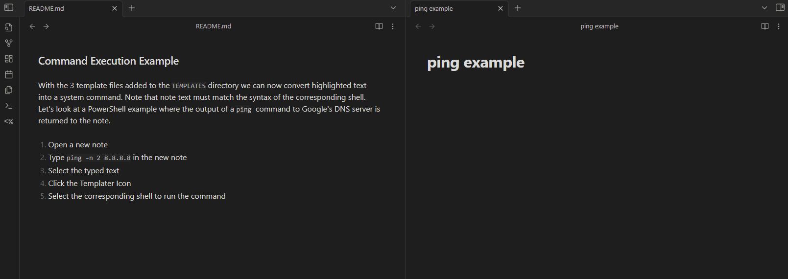
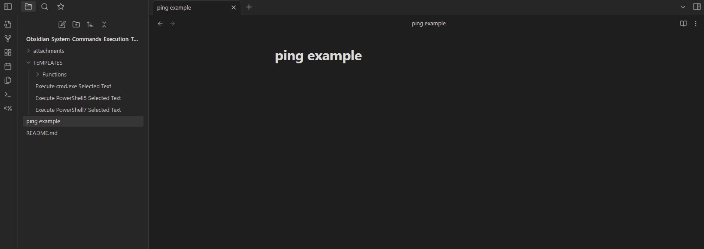

This vault is to showcase the power of using user defined functions and system commands created through the `Templater` plugin. 

## Forewarning 

Keep in mind that running system commands through any application is to be considered extremely dangerous if you don't know what you're doing.  In normal circumstances when applications pass user input through an `exec()` or `eval()` statement, the result can lead to remote command execution if the passed input isn't properly sanitized. Given that Obsidian is a _local_ application that isn't interacting with remote user input, I'm comfortable extending Obsidian the benefits of running local scripts and Cmdlets to have their output parsed directly into the note I'm working on. 

With that said, **DO NOT RUN COMMANDS POSTED ON THE INTERNET IF YOU DON'T FULLY UNDERSTAND WHAT THEY ARE DOING**. I accept 0 responsibility for what you do with the educational information provided in this repository. If you run something that wipes your entire OS of the face of the earth, that's on you. 

## Steps 

The following are requirements to grant Obsidian access to return output of system commands into notes. 

1. Enable community plugins (Disable `safe mode`)
2. Download Templater 
	1. Create a templates folder 
	2. Enable system commands 
	3. Create user defined shell execution functions 
	4. Map hotkeys to each desired shell 
3. Execute system command and have output returned directly to note


### Enabling Community Plugins 

Open settings with `Ctrl+ ,` > `Community Plugins` > `Turn on Community Plugins`


Click `Browse`


Type `Templater` and select the plugin by `SilentVoid`. Click `Install` then `Enable`. 


### Creating Template Folder 

Create a template folder in your desired location within the vault. I chose the root of the vault because it's easier to navigate and create templates but the folder name or location doesn't matter. 


I will also create a `Functions` folder under the `TEMPLATES` folder to hold user defined JavaScript functions (we'll go over this in a bit) which similarly extend scripting capabilities but their setup is a bit more involved. This step isn't necessary if you're only wanting to run system commands and have their output returned to the calling note. 


### Enabling Templater System Commands 

Open Templater's settings menu and set the template folder to the first created folder. In my case it is the `TEMPLATES` folder. This grants Templater access to templates within the folder of our choosing. Tweak the `Timeout` seconds if you think you'll be running commands that will take longer than 5 seconds to return output. 


> [!Note] Console Differences
> Windows and \*Nix systems use different shells for command execution. Tweak your `Shell binary location` to match the shell your system is using i.e. `/bin/bash`, `/usr/bin/sh`, `/bin/zsh` etc. For Windows machines this can be left blank. Windows will automatically scan the system $PATH variable to find the shells we define in the next section. 


### Creating User Functions 

User Functions allow us to map system command strings containing variables to JS functions that can be invoked through Templater. Template variables are passed to the defined functions as arguments that are defined when invoking the function. 

There are two ways to create user functions via Templater: 

1. Templater's `Add New User Function` option which allows us to create a user function directly in Templater's settings menu. 
2. Enabling Templater's `User Script Functions` which enables supported for exported JS script modules. 

We'll be covering option 1 now as it is the easier of the two options. A sample `User Script Function` will be included in the [[#Appendix]] section. 

In `User System Command Functions` click `Add New User Function` and add the desired function names and command strings for each shell. 


Function Name | System Command String | Variable Name 
--- | --- | --- 
`cmd_exec` | `cmd /C %Cmd%` | `Cmd` 
`pwsh5_exec` | `PowerShell -NoProfile -Command Invoke-Expression("$Env:Pwsh")` | `Pwsh` 
`pwsh7_exec` | `pwsh -NoProfile -Command Invoke-Expression("$Env:Pwsh")` | `Pwsh` 


After a function is created with this method it can be invoked via a Templater template using the syntax: 

```js
<% tp.user.<function_name>({<Variable Name>: <input source> }) %> 
```

Lets break down an example that will convert selected note text into a PowerShell command. This command can be copied and run despite being broken into multiple lines. I personally comment my templates like this to remember exactly how the template functions. 

```js
<% 
// Templater required opening tag 
tp. // Templater object 
user. // User Functions
pwsh5_exec({ // Use the "Function Name" pwsh5_exec which maps to Invoke-Expression 
Pwsh: // "Pwsh" part of "$Env:Pwsh" i.e. the argument expected by pwsh5_exec
tp.file.selection() // The command that will be executed / What has been highlighted on the screen
})
// template required closing tag stripping whitespace after inserting output
_%>
```

Now that the template format is understood, we can create new templates mapping to `PowerShell5.1`, `PowerShell7`, and `Cmd.exe`. Create 3 new files under the `TEMPLATES` directory: 

- `Execute PowerShell5 Selected Text`
- `Execute PowerShell7 Selected Text`
- `Execute cmd.exe Selected Text`


Pate the following into each respective file. Note that the `variable` and `argument` have been augmented to match the functions we created in the beginning of [[#Creating User Functions]]. 

#### Execute PowerShell5 Selected Text
```js 
<% 
// Templater required opening tag 
tp. // Templater object 
user. // User Functions
pwsh5_exec({ // Use the "Function Name" pwsh5_exec which maps to Invoke-Expression 
Pwsh: // "Pwsh" part of "$Env:Pwsh" i.e. the argument expected by pwsh5_exec
tp.file.selection() // The command that will be executed / What has been highlighted on the screen
})
// template required closing tag stripping whitespace after inserting output
_%>
```

#### Execute PowerShell7 Selected Text
```js 
<% 
// Templater required opening tag 
tp. // Templater object 
user. // User Functions
pwsh7_exec({ // Use the "Function Name" pwsh5_exec which maps to Invoke-Expression 
Pwsh: // "Pwsh" part of "$Env:Pwsh" i.e. the argument expected by pwsh7_exec
tp.file.selection() // The command that will be executed / What has been highlighted on the screen
})
// template required closing tag stripping whitespace after inserting output
_%>
```

#### Execute cmd.exe Selected Text
```js 
<% 
// Templater required opening tag 
tp. // Templater object 
user. // User Functions
cmd_exec({ // Use the "Function Name" cmd_exec which maps to cmd /C  
Cmd: // Argument expected by cmd_exec i.e. %Cmd%
tp.file.selection() // The command that will be executed / What has been highlighted on the screen
})
// template required closing tag stripping whitespace after inserting output
_%>
```


### Command Execution Example 

With the 3 template files added to the `TEMPLATES` directory we can now convert highlighted text into a system command. Note that note text must match the syntax of the corresponding shell. Let's look at a PowerShell example where the output of a `ping`  command to Google's DNS server is returned to the note. 

1. Open a new note 
2. Type `ping -n 2 8.8.8.8` in the new note 
3. Select the typed text 
4. Click the Templater Icon 
5. Select the corresponding shell to run the command 



Start to see how incredibly powerful this capability is, particularly with ingesting data into our PKMs. I run a substantial number of scripts during penetration testing whose output is eventually copy and paste into Obsidian. This functionality will significantly reduce the overhead by automating data ingestion into Obsidian. We can also execute local scripts in the same manor that might generate markdown formatted output, which in term would automatically format the note to our liking. 

### Executing a PowerShell Script

The following script is named "Get-ObsidianThings.ps1". It collects data about the computer and first registered ethernet card, then outputs content into a Markdown formatted table. 

```powershell
# Get-ObsidianThings.ps1
# showcase how output can be formatted to markdown from within a script
$HostName = $env:COMPUTERNAME
$Accountname = $env:USERNAME
$CMDPath = $env:ComSpec
$OSType =  $env:OS

$NetAdapter = Get-NetAdapter |Select-Object -First 1 | Select-Object DriverName, Name, DriverVersion

$NetCardname = $NetAdapter.Name 
$NetCardDriverPath = $NetAdapter.DriverName
$NetCardDriverVer = $NetAdapter.DriverVersion


# Format the markdown that will exist in note 

"# System information" | Write-Output
"## Computer information`n" | Write-Output
"Host Name | User Name | CMD Path (Comspec) | OS Type" | Write-Output
" --- | --- | --- | --- "| Write-Output
"``$HostName``|``$Accountname``|``$CMDPath``|``$OSType```n" | Write-Output
"## Network Adaper Informaiton`n"| Write-Output
"Card Name | Driver Path | Driver Version"| Write-Output
" --- | --- | --- "| Write-Output
"``$NetCardname``|``$NetCardDriverPath``|``$NetCardDriverVer```n"| Write-Output
"All values were produced from Get-ObsidianThings.ps1"| Write-Output
```

To invoke this script, type the script's full path and select the text as before before running the Templater PowerShell execution template.  **NOTE** when running on windows each backslash character `\` needs to be escaped with a second backslash or all slashes must be converted into forward slashes to run the command. 


Select the text and use the appropriate shell execution template to run the command. Output will be written directly into the note. 


The `ping` example was nice but this example showcases the potential of pre-emptively wrapping script output into markdown format, circumventing the need to copy and paste (and reformat) script output into our PKM systems. 


### Mapping Template Hotkeys 

The execution templates can also be mapped to hot keys further reducing overhead. To map one of the shell executions to a hot key open `Templater settings > Template Hotkeys >` and add each shell to the hotkey of choice. 


The hotkey can then be configured through the context menu. 


Now to execute a system command through PowerShell5, simply highlight the text and press `Ctrl + Shift + 1` to have its output returned to the terminal. 




## Appendix 

### Creating CommonJS Modules (Script Modules) 
Documentation on a simple script module can be found on Templater's [Help Page](https://silentvoid13.github.io/Templater/)
Enable script modules by specifying the module path. In my case its `TEMPLATES/Funtions`. 


To extend a script module to Templater, a script must be placed in the above folder. Script modules must end in `.js`. Obsidian by default doesn't show unknown filetypes. This setting must be changed within `Files & Links`. 


Open your favorite text editor and paste the following, naming the file `shell.js`.  This won't be possible through Obsidian because it doesn't have a handler for `.js` files. 
> credits: https://forum.obsidian.md/t/templater-system-commands-file-lists-weather-and-git/36197

```js
// In: cmd = a complete command to run in the command line shell. It is up 
//           to the user to make certain the command is properly formatted 
//           for their platform
// Out: an object with two properties:
//      out = the trimmed content the command sent to standard out.
//      err = the trimmed content the command sent to standard error.
async function shell(cmd)
{
   const { promisify } = require('util');
   const exec = promisify(require('child_process').exec);
   const result = await exec(cmd);
   return {out: result.stdout.trim(), err: result.stderr.trim()};
}
module.exports = shell;
```

This example supposedly works on Linux based systems but it fails as it is on Windows. This example is for edification purposes to show how exporting modules works. 

To extend the module functionality to Templater, open settings and click the refresh button. The module should then appear in `Detected (x) User Scripts`. 


- this module would then be used by calling `tp.user.shell(<args>)` the same way previous functions were called. 


### Resources 
- https://medium.com/@gareth.stretton/obsidian-do-almost-anything-really-with-system-commands-b496ffd0679c 
- https://github.com/djjoa/Obsidian-System-Commands-Execution-Templates
- https://silentvoid13.github.io/Templater/user-functions/script-user-functions.html
- https://silentvoid13.github.io/Templater/introduction.html